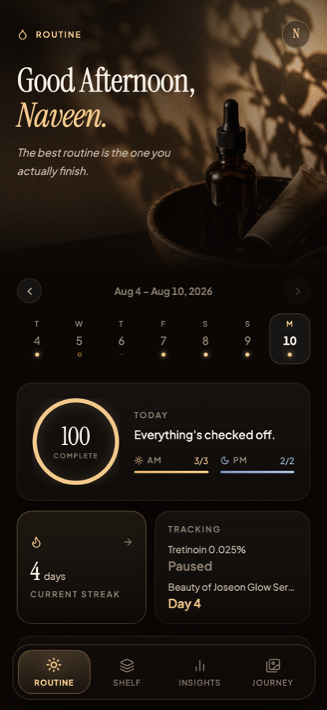
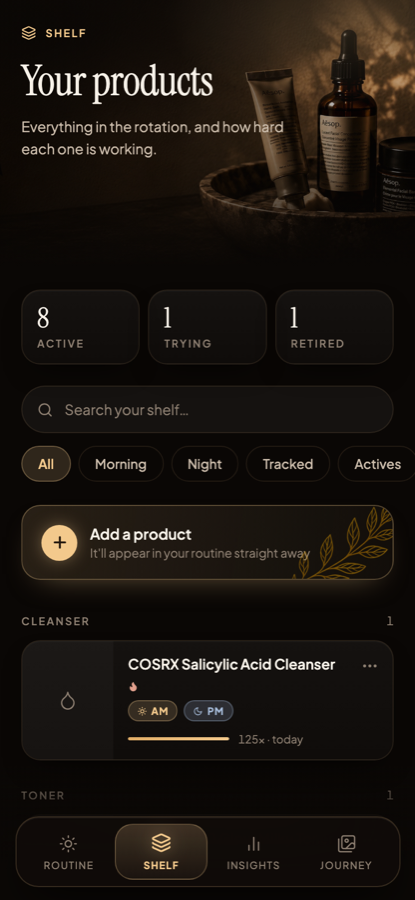
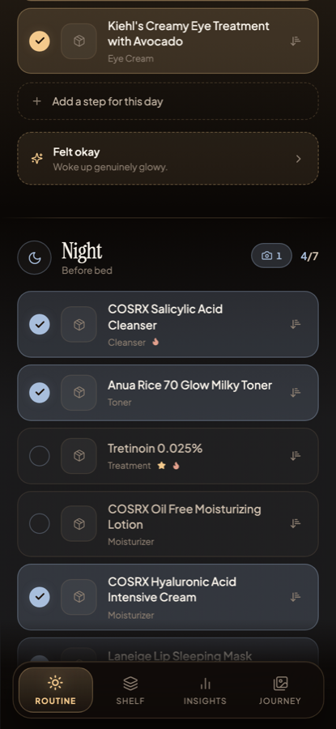
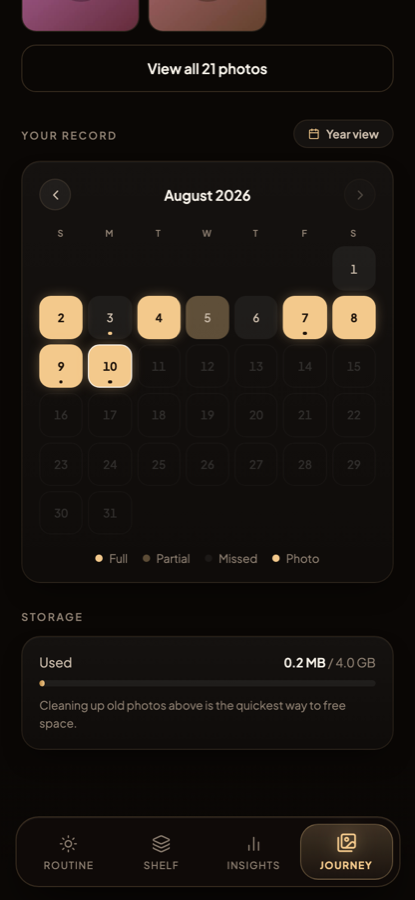
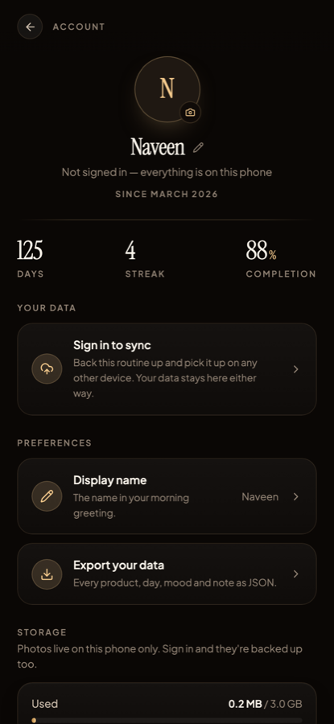
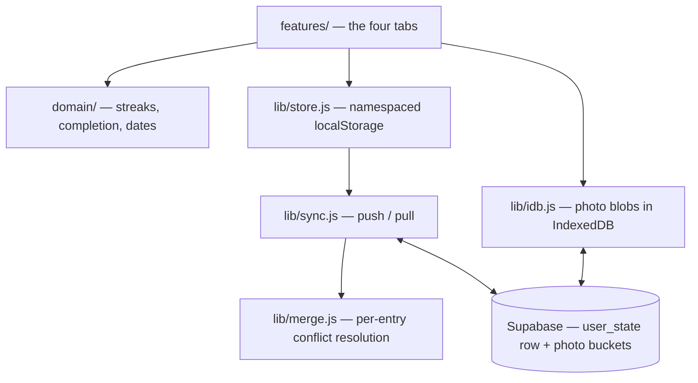

<div align="center">

# Skinmaxxing

**A skincare routine tracker that treats your history as a record, not a scoreboard.**

Track an AM/PM routine, the products on your shelf, and progress photos over months —
on your phone, offline, with or without an account.

[**Open the app →**](https://skinmaxxing.netlify.app)


<br />


&nbsp;

&nbsp;


</div>

---

## Overview

Most habit trackers quietly rewrite the past. Retire a product and last month's "perfect
week" silently becomes imperfect, because yesterday is scored against today's setup.

Skinmaxxing doesn't do that. Every product records the date ranges it was actually part
of the routine, so **a day is always judged against the shelf as it stood on that day.**
Retiring your only sunscreen today cannot break a streak from March. That guarantee is
structural — it lives in the data model, not in a rule someone has to remember.

The rest follows from taking the same care with everything else: it works offline, it
works without an account, and it never blocks the UI on a network request.

**Built for** anyone running a real multi-step routine who wants an honest record of what
they actually did — and photographic evidence of whether it worked.

---

## Features

**Routine**
- Separate AM and PM checklists with per-period completion
- One-off changes to a single day — add or skip a step without touching the product's status
- Copy yesterday's routine forward to a blank day
- Mood and a note per period, plus a weekly reflection
- Warns when two exfoliating actives are checked in the same period
- "Tracked" products get a consecutive-day counter (useful for retinoid ramp-ups)

**Shelf**
- Products grouped by category, with search and AM / PM / Tracked / Actives filters
- Three statuses — active, trying, retired — with a reason recorded on retirement
- Per-product usage totals, last-used date, and a month-by-month usage history

**Insights**
- Current and all-time-best streaks
- Monthly consistency percentage and a six-month trend
- Mood distribution, AM vs PM adherence, and category balance
- Full export of every product, day, mood and note as self-describing JSON

**Journey**
- Progress photos tagged AM or PM, up to five per slot
- Compare any two dates, with 30 / 90-day presets
- Month calendar marking full, partial, missed and photographed days
- Storage meter and a bulk cleanup for photos older than 90 days

**Account**
- Google sign-in with cross-device sync — or stay a guest, entirely on-device
- Guest data is never silently absorbed into an account; conversion is offered, explained, and always keeps the local copy
- Installable as a PWA with its own home-screen icon
- Works offline, including with an expired token

---

## Preview

| Daily checklist | Progress calendar | Account |
|:---:|:---:|:---:|
|  |  |  |
| Per-day edits, mood, and exfoliant flags | Full · Partial · Missed · Photo | Guest mode, storage, and export |

---

## How it works

1. **Start immediately.** Continue as a guest — no account, no email, nothing leaves the phone.
2. **Add your products.** Category, whether it's morning, night or both, and optional flags for tracked or exfoliating.
3. **Check off each day.** AM and PM are scored separately; add or skip a step for just today when real life happens.
4. **Photograph the change.** Attach progress photos, then compare across 30 or 90 days.
5. **Read the record.** Streaks, consistency and category balance — or export the whole history as JSON.
6. **Sign in when you want it backed up.** Your guest data stays where it is; bringing it across is an explicit choice.

---

## Tech stack

| Layer | Choice | Why |
|---|---|---|
| **UI** | React 18, Framer Motion, Lucide | Motion is used for state changes, not decoration |
| **Build** | Vite 6, `vite-plugin-pwa` | Generates the service worker and manifest |
| **Local storage** | localStorage + IndexedDB | Small JSON locally; photo blobs in IndexedDB, since browsers cap localStorage near 5 MB |
| **Backend** | Supabase — Postgres, Storage, Auth | Row-level security, plus triggers enforcing per-account quotas |
| **Auth** | Supabase Auth, Google OAuth (PKCE) | Google is the only door; the email-code path was deliberately removed |
| **Testing** | Playwright | 285 assertions driving the real app against an intercepted backend |
| **Hosting** | Netlify | Auto-deploys from `main` |

No state-management library, no component library, no CSS framework — the design system
is ~400 lines in `components/primitives.jsx`.

---

## Architecture

**Local-first.** localStorage is the source of truth the UI reads; Supabase is a replica.
No interaction ever waits on the network.



Three ideas carry most of the weight:

**Immutable history.** Products carry `stints` — the ranges they were in the routine — so
past days are scored against the shelf of that day. Changing today never rewrites yesterday.

**Identity epochs.** Every read, write and sync is stamped with the identity it belongs to
(`uid` or `"guest"`). The boot read records *which identity it finished for*, and sync
refuses to run unless that matches. Without this, signing out of one account and into
another in the same tab could push the first account's routine into the second's row. The
render gate is computed during render, not in an effect, because effects run after paint.

**Per-entry reconciliation.** Conflicts resolve field by field using change stamps produced
at the persistence seam — which is why editing AM on a phone and PM on a tablet the same
day keeps both, and why no UI code needs to know sync exists.

---

## Project structure

Four layers; each may only depend on the ones below it.

```
src/
├── App.jsx            container — all state, the boot read, sync wiring
├── features/          one folder per tab; presentational, owns no persistence
│   ├── today/           the routine and per-day edits
│   ├── shelf/           product catalogue and editor
│   ├── insights/        streaks, consistency, analysis
│   ├── journey/         calendar, photos, comparison
│   └── account/         sign-in, account screen and its sheets
├── components/        design system + shared widgets — knows no domain concepts
├── domain/            pure logic. No React, no JSX, no I/O
│   ├── routine.js       what counts as done, and streaks — the core rules
│   ├── calendar.js      month grids
│   ├── dates.js         YYYY-MM-DD handling
│   ├── catalog.js       categories, statuses, moods, filters
│   └── exportData.js    the full history as JSON
├── lib/               infrastructure. No JSX
│   ├── auth.js          auth state machine, incl. offline-unverified
│   ├── sync.js          push/pull with optimistic concurrency
│   ├── merge.js         conflict resolution
│   ├── store.js         namespaced localStorage
│   └── idb.js           IndexedDB wrapper
└── styles/theme.js    design tokens and the global stylesheet
```

**Where to make a change**

| To change… | Edit |
|---|---|
| what counts as a complete day, or a streak | `domain/routine.js` |
| how two devices reconcile an edit | `lib/merge.js` |
| spacing, colour or type everywhere | `styles/theme.js`, `components/primitives.jsx` |
| a single screen | the matching folder in `features/` |
| the product categories | `domain/catalog.js` |

---

## Getting started

### Prerequisites

Node 20 or newer.

### Installation

```bash
git clone https://github.com/naveenlabs/Skinmaxxing-App.git
cd Skinmaxxing-App
npm install
npm run dev            # http://localhost:5173
```

That is the entire setup. **With no Supabase credentials the build tree-shakes Supabase
out and the app runs fully local** — no sign-in screen, everything on the device. This is
deliberate: it's what lets the test suite run without a backend.

### Environment variables

Only needed to enable sign-in and sync:

```bash
cp .env.example .env.local
```

| Variable | Purpose |
|---|---|
| `VITE_SUPABASE_URL` | Your Supabase project URL |
| `VITE_SUPABASE_ANON_KEY` | The anon/publishable key |

Both are public by design — they ship in the client bundle. **Row-level security is what
actually protects the data**, which is why the backend setup matters more than the keys.
The same two variables must be set in Netlify for a deployed build.

### Build

```bash
npm run build          # emits dist/ with service worker + manifest
npm run preview        # serve the production build locally
```

### Backend

The database schema, quota triggers, storage buckets and dashboard settings are
documented in **[docs/SETUP.md](docs/SETUP.md)**, which is the authority on that setup.
It is required for sign-in, sync and photo backup — not for local development.

---

## Data & privacy

| Data | Guest | Signed in |
|---|---|---|
| Products, daily logs, photo index | localStorage, this device only | localStorage + `user_state` row |
| Progress photos | IndexedDB, this device only | IndexedDB + private Storage bucket |
| Avatar | IndexedDB | Private `avatars` bucket |
| Display name | This device — **never uploaded** | Synced with the account |

**Guest data never leaves the device.** Nothing is uploaded, and sync is a no-op.

**Signing in does not absorb your guest data.** For a new account you're *asked* whether to
bring it across; for an account that already has a routine, nothing is merged and you're
told so plainly. Either way the local copy survives — the conversion is a copy, never a move.

**Local storage is namespaced per account** (`glass:` for guest, `glass:u_<uid>:` when
signed in), which is what keeps two accounts on one phone from seeing each other. This is
asserted by a dedicated regression suite.

**Server-side limits are enforced by Postgres triggers**, not by the client: 5 MB per
account for routine data and 200 MB per bucket for photos. Row-level security restricts
every row and every storage object to its owner.

**Delete everything** removes the remote copy first and aborts if that fails — so a failed
wipe can't leave you believing data is gone when it isn't — then clears local data and
signs you out.

---

## Testing

Playwright drives the real application against an intercepted Supabase, asserting
behaviour rather than implementation. **285 assertions across eight suites.**

```bash
npm run dev            # one terminal
npm run verify         # another
```

| Suite | Guards |
|---|---|
| `verify:identity` | **The cross-account leak.** Seeds as A, signs out, signs in as B, asserts zero bytes of A reach B's row or screen. Must never fail. |
| `verify:offline` | An expired token offline still opens your own data, rather than a sign-in wall |
| `verify:account` | Guest lifecycle, guest→account conversion, avatars, deletion |
| `verify:merge` | Conflict resolution, tombstones, field-level day merging |
| `verify:p1` / `verify:p2` | The four tabs, edge cases, retirement, immutability of history |
| `verify:auth` | The auth state machine and sign-in gate |
| `verify:storage2` | IndexedDB migration, the meter, namespace isolation |

Also available: `verify:a11y` (reduced-motion and accessible names), `check:phone`
(renders correctly over the LAN on a real device), `shots` (screenshot capture).

---

## Security

- Google OAuth is the only sign-in path. The email one-time-code flow was removed from
  the app *and* disabled at the provider — removing a button only changes the UI, the
  endpoint stays live until it's turned off in the dashboard.
- Row-level security scopes every database row and storage object to its owner. A
  redundant trigger re-checks ownership on write, so a loosened policy alone isn't enough
  to cross accounts.
- Every avatar and progress photo is re-encoded in the browser before upload, so the file
  actually stored is never the file that was picked.
- No secrets are committed. `.env.local` is gitignored and has never been in the history;
  `.env.example` contains placeholders only.

Found something? Open an issue — please don't include credentials or personal data.

---

## Roadmap

- Static type checking and linting — the highest-value remaining gap
- Code-splitting the bundle per route
- Ingredient-conflict warnings beyond the current exfoliant check
- Optional reminders (not currently implemented in any form)

---

## License

**All rights reserved** — see [LICENSE](LICENSE).

The source is public to read and to learn from. It is **not** licensed for reuse,
modification or redistribution without written permission.
